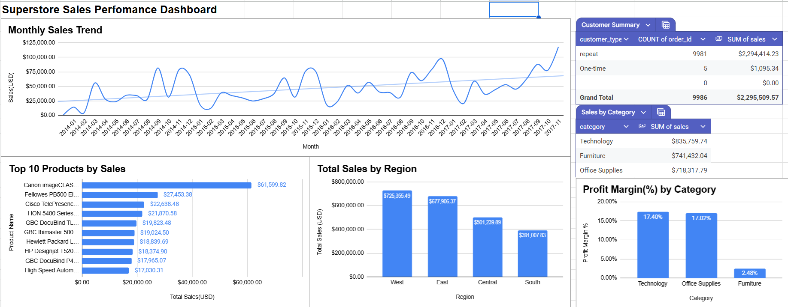

# Superstore Sales Performance Dashboard

## Overview
This project analyses retail sales data from the Superstore dataset using Google Sheets. The objective was to understand sales performance, identify key revenue drivers, and evaluate profitability across products, regions, customers, and categories.

## What was done
- Cleaned and structured transactional sales data
- Engineered time-based features for trend analysis
- Created pivot tables to analyse:
  - Monthly sales trends
  - Top-selling products
  - Regional sales performance
  - Customer purchasing behaviour
  - Profit margins by category
- Designed a clear, executive-style dashboard combining charts and summary tables

## Key insights
- Sales show a steady upward trend with seasonal fluctuations
- A small number of products generate a large share of total revenue
- The West and East regions contribute the highest sales
- The business relies heavily on repeat customers
- Technology has the strongest profit margins, while Furniture shows weak profitability despite high sales

## Tools used
- Google Sheets
- Pivot Tables
- Charts & Tables

## Live dashboard
A view-only version of the dashboard is available here:https://docs.google.com/spreadsheets/d/1TFWVurpOh-yjfUIyWQ9JfbXMrk_9uDLfuuqWzn255qw/edit?usp=sharing
## Dashboard Preview

